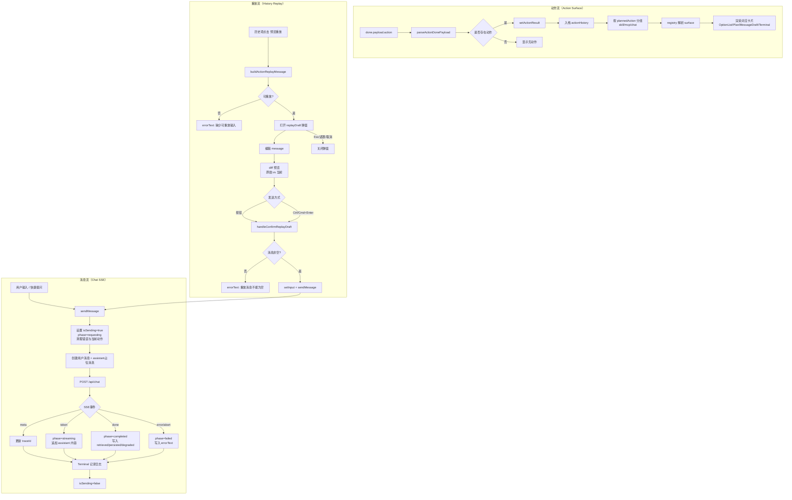

# UI 状态流转说明（Tool UI Chat Workbench）

本文档描述当前 UI 层（`components/chat/tool-ui-chat-workbench.tsx`）的核心能力、状态流转和字段映射关系，便于评审、联调和后续扩展。

---

## 1. 目标

- 明确 Chat UI 的三条主流程：**消息流**、**动作流**、**重放流**。
- 标准化前端状态字段和展示区域的关系，降低维护成本。
- 为新增 Tool UI 卡片、动作解析器、交互策略提供统一参考。

---

## 2. UI 功能模块概览

- **对话区**：消息气泡 + SSE 流式更新 + 停止生成。
- **执行进度区（Plan）**：请求、检索、生成、写回四段状态。
- **动作结果区（Plan + Action Surface）**：当前动作、历史动作分组、动作卡片渲染。
- **重放弹窗**：历史动作可编辑重放，支持差异预览与快捷键发送。
- **请求诊断区（Terminal）**：展示请求与流式过程日志，保留历史会话。
- **草稿区（MessageDraft）**：从最近 assistant 回复生成邮件草稿并执行模拟发送。
- **鉴权配置区**：JWT 模式与 Header 本地模式切换输入。
- **快捷提问区（OptionList）**：预置 starter prompts。

---

## 3. 状态流转图（三条主链路）

---

## 4. 状态字段 → UI 区域对照表

| 状态字段 | 主要来源 | UI 展示区域 | 更新时机 |
| --- | --- | --- | --- |
| `messages` | `sendMessage` + SSE `token/done` | 主聊天气泡区 | 发送时插入占位；token 增量拼接；done 回填元信息 |
| `phase` | 发送生命周期 | 左侧「对话执行进度」Plan | `requesting`/`streaming`/`completed`/`failed` |
| `isSending` | 请求生命周期 | 发送按钮/停止按钮、禁用态 | 请求开始置 `true`，最终置 `false` |
| `traceId` | SSE `meta/done` | 进度 Plan、assistant 元信息、Terminal | 收到 meta/done 即更新 |
| `retrievedCount` | SSE `done` | 进度 Plan、assistant 元信息 | done 时更新 |
| `persistedCount` | SSE `done` | 进度 Plan、assistant 元信息 | done 时更新 |
| `errorText` | 异常/校验逻辑 | 主区错误提示条 | 请求失败、重放参数缺失、空消息提交等 |
| `actionResult` | `done.payload.action` | 左侧「动作执行卡片」当前动作 | done 后解析成功即更新 |
| `actionHistory` | `actionResult` 入栈 | 左侧动作历史列表 | 每次动作完成后头插并截断长度 |
| `historyGroupOpen` | 本地交互 | 动作历史分组折叠状态 | 用户点击折叠组标题 |
| `replayDraft` | 历史动作重放入口 | 重放弹窗 | 点击「预览重放」创建；发送/取消/Esc 清空 |
| `replayDiffPreview`（计算态） | `replayDraft` 派生 | 重放弹窗差异区 | 弹窗内编辑时实时计算 |
| `activeTerminal` | 发送请求期间 | 「请求诊断」Terminal 当前会话 | 请求开始创建，结束归档为历史 |
| `terminalHistory` | `activeTerminal` 归档 | 「请求诊断」历史会话 | 请求结束时入栈并截断 |
| `emailDraft` | 最近 assistant 回复 | MessageDraft 卡片 | 点击「生成邮件草稿」创建；取消后清空 |
| `draftNotice` | 草稿交互 | 草稿区提示文案 | 生成/发送/撤销/取消时更新 |
| `threadId` | `localStorage` + 新线程按钮 | 进度 Plan、输入区 thread 文案 | 初始化或点击「新线程」时变更 |
| `jwtToken`/`tenantId`/`userId` | 鉴权输入区 | 鉴权配置面板 | 用户输入时更新 |

---

## 5. 快捷键与关键交互

- 主输入框：`Enter` 发送，`Shift + Enter` 换行。
- 重放弹窗：
  - `Ctrl/Cmd + Enter` 发送重放；
  - `Esc` 关闭弹窗；
  - 点击遮罩关闭弹窗。
- 发送中可点击「停止」中断流式请求。

---

## 6. 扩展建议

- 将重放差异算法升级为 LCS/最小编辑路径，提升插入/删除块的可读性。
- 为动作历史增加筛选（按 executor、时间范围、是否失败）。
- 将状态流转埋点输出到统一监控（如 trace + UI event timeline）。

